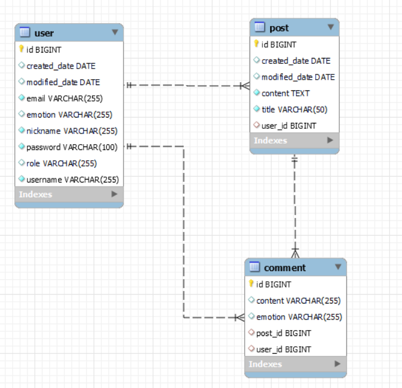
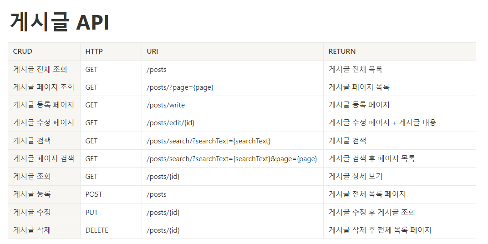
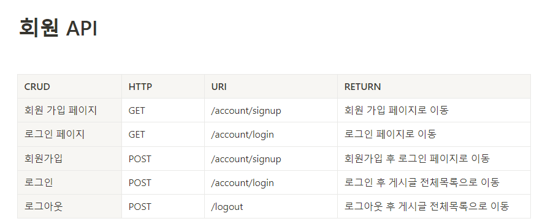
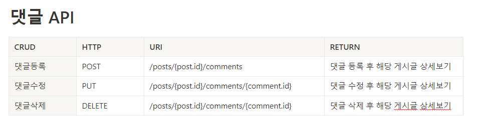

# Emotion Filter Community
## 1. 프로젝트 소개
인터넷의 익명성이 주는 단점 중에 하나는 남이 쓴 부정적인 글에 상처를 받을 수 있다는 점이라고 생각합니다.

기본적인 CRUD 기능을 가진 커뮤니티에 댓글 작성 시 글의 내용을 네이버 감정분석 API를 이용해 긍정, 중립, 부정 태그를 매겨 사용자가 원하는 감정범위의 댓글을 볼 수 있는 댓글감정 필터링 서비스를 추가해 구현해가며 배워보고 싶어 시작했습니다.

## 2. 프로젝트 기능
    게시판 - CRUD, 페이징 처리, 검색
    사용자 - 회원가입, 로그인
    댓글 - CRUD, 감정분석 태그, 댓글 필터링
## 3. 사용기술
주요 프레임워크/라이브러리
- Java11
- SpringBoot 2.7.6
- JPA(Spring Data JPA) 5.6.14
- Spring Security 5.7.5
- Naver Clover Sentiment 감정분석 API

빌드툴
- gradle 7.6

데이터베이스
- MySQL 8.0.28

프론트엔드
- Html/CSS
- Thymeleaf 3.0.15

## 4. 요구사항 분석
 1. 회원 가입 페이지
    - 유효성 검사
      - 닉네임은 2~10자이며, 특수문자를 제외한 한글 (ㄱ\~ㅎ, 가\~힣), 알파벳 대소문자(a\~z, A\~Z), 숫자(0\~9)로 구성
      - 이메일은 @를 포함한 이메일 형식으로 구성
      - 비밀번호는 8~16자이며, 영문 대소문자, 숫자, 특수문자로 구성
      - 전체적으로 빈칸, 공백 확인
    - 중복 확인
      - DB에 존재하는 아이디로 회원 가입 시에 중복예외
      - DB에 존재하는 닉네임로 회원 가입 시에 중복예외
      - DB에 존재하는 이메일로 회원 가입 시에 중복예외
 2. 로그인 페이지
    - 미 로그인 시 이용 가능 페이지
      - 회원 가입 페이지
      - 로그인 페이지
      - 게시글 목록 페이지
      - 게시글 상세보기 페이지
      - 게시글 검색 목록 페이지
      - 외에 로그인 필요한 페이지에 접근시 로그인 페이지로 이동
    - 로그인 
      - 아이디 또는 비밀번호가 일치하지 않을 경우 로그인 에러 처리
      - 로그인 성공 시 게시글 목록 페이지로 이동
 3. 회원 정보 수정
    - 사용자 정보 (닉네임, 비밀번호) 수정
      - 아이디, 이메일은 읽기 전용
      - 전체적으로 빈칸, 공백 확인
      - DB에 존재하는 닉네임로 회원 가입 시에 중복예외
      - 닉네임은 2\~10자이며, 특수문자를 제외한 한글 (ㄱ\~ㅎ, 가\~힣), 알파벳 대소문자(a\~z, A\~Z), 숫자(0\~9)로 구성
      - 비밀번호는 8~16자이며, 영문 대소문자, 숫자, 특수문자로 구성
    - 사용자 감정 수정
      - 감정 드롭다운으로 선택, 현재 비밀번호 입력
      - 비밀번호 미 일치시 알람창 예외처리 및 리다이렉트
 4. 게시글 검사
    - 게시글 작성, 수정 시 제목, 내용 빈칸, 공백 확인
      - 예외 발생 시 리다이렉트
    - 작성자만 수정, 삭제 등 글관리 가능
 5. 댓글 검사
    - 댓글 작성, 수정 시 내용 빈칸, 공백 확인
      - 예외 발생 시 알람창 및 리다이렉트
    - 작성자만 수정, 삭제 등 댓글관리 가능
 6. 댓글 필터링
    - 댓글 작성, 수정 시 감정분석 API 연동해 감정태그 추가
    - 사용자의 감정에 따라 게시글 상세 조회 시 조건에 맞지 않는 댓글 삭제
      - 긍정일 때, 긍정을 제외한 댓글 삭제
      - 중립일 때, 부정 댓글 삭제
      - 부정일 때, 모든 댓글 조회
## 5. DB 설계

## 6. API 설계

## 7. 개발
- [Spring Security + Spring Data JPA Login Process 알아보기, 회원가입 로그인 구현](https://anythingis.tistory.com/79)
- [Spring Data JPA, JPA Repository + Pageable 이용한 페이징](https://anythingis.tistory.com/80)
- [Spring Data JPA, JPA Repository + 쿼리 파생문 이용한 검색 페이징](https://anythingis.tistory.com/81)
- [Spring의 RestTemplate으로 외부 API 이용하기(Naver 감정분석 API 이용한 댓글 감정분석), 댓글 작성 구현](https://anythingis.tistory.com/82)
- [Spring Security + Thymeleaf Extras SpringSecurity, JPA 연관관계 맵핑으로 글 작성자의 글관리 구현](https://anythingis.tistory.com/83)
- [JPA Auditing 생성일, 수정일 추가](https://anythingis.tistory.com/84)
- [댓글 작성자만 수정, 삭제 기능 구현](https://anythingis.tistory.com/86)
- [BindingResult + Thymelaf 이용한 회원정보 유효성검사, 중복검사 구현, Spring Security 이용한 로그인 예외 처리 구현](https://anythingis.tistory.com/87)
- [Spring Boot Basic Error Controller 이용한 에러 페이지 처리, ControllerAdvier + ExceptionHandler 이용한 UnchekdExcpetion 핸들링](https://anythingis.tistory.com/89)
- [댓글 서비스 내에 댓글 필터링 구현](https://anythingis.tistory.com/89)
- [DB 변경 및 Spring Security UsernamePasswordToken 재등록을 통한 유저의 댓글 필터링 서비스 적용 감정 변경, 유저정보 변경](https://anythingis.tistory.com/90)
- [Thymeleaf Extras Security의 Principal 접근으로 세션 정보 표기](https://anythingis.tistory.com/91)
## 8. 후기
CRUD 기능을 구현하면 기본적으로 많이 만드는 게시판에 추후에 만들고싶은 감정 커뮤니티의 일부의 아이디어인 댓글 작성을 할 때 감정을 분석해 커뮤니티를 이용하면서 댓글을 필터링하는 서비스를 추가해 구현했습니다. 
자바, 스프링을 배우면서 강의를 보면서 따라가긴 많이 해봤지만 혼자 힘으로 시작하는 첫 프로젝트여서 많이 막히기도 했지만 많이 배웠습니다.

프로젝트를 끝내고 배운 점은
### 1. 사이드 서버 렌더링의 장단점
#### 장점 
#### 서버와 화면이 유기적이지만  생산성이 높다.
- View Layer에서 Thymeleaf Security를 통해 인가를 손쉽게 구현할 수 있었습니다. View Layer에서 세션에 접근하는 것은 너무 유기적일 수도 있지만 개발자가 View와 Controller 모두 관리할 수 있는 작은 규모의 개발에선 높은 생산성을 가질 수 있을 것 같다는 생각을 했습니다.

#### 단점

#### REST API 설계가 어렵다
- MVC 패턴을 사용해 API 설계와 컨트롤러를 테스트 하지 못하고 API 문서화 등을 진행하지 못했습니다.

### 2. 스프링 시큐리티의 인증, 인가 흐름에 대한 이해
### 3. 스프링 AOP, ExceptionHandler 이용한 메인 로직에서 예외처리 분리

이 프로젝트로 DB설계가 간단하고 서비스 로직도 간단한 주제를 구현하면서 스프링부트의 전반적인 부분에 대해 공부하면서 지식과 자신감을 쌓았고 앞으로의 프로젝트에는 객체지향을 더 알아가며 좀 더 복잡한 서비스에 녹여보고 싶다는 목표와 다음엔 프론트엔드와 협업도 해보기 위해 REST 아키텍쳐를 적용한 프로젝트롤 진행하고 싶은 목표가 생겼습니다.

읽어주셔서 감사합니다.